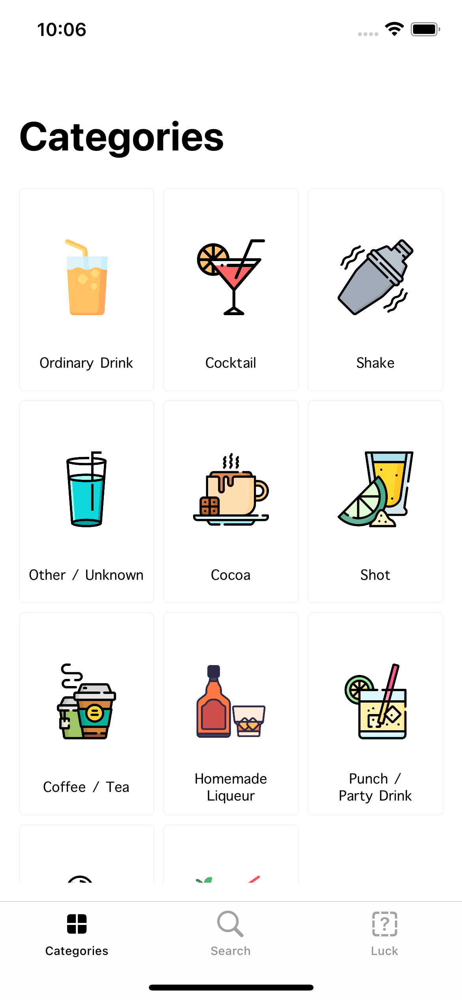

# 🍸 CocktailApp (using MVC, MVVM)
 This application is a cocktail app developed using the Swift programming language. Users can list drinks in different categories with different cards, filter drinks by categories, search by drink names, and access drink recipes

## 🔎 Preview
### 1. Ana Ekran

  
  
</strong> Bu, uygulamanın ana ekranını gösterir.

---

## 📚 Libraries
- [Alamofire](https://github.com/Alamofire/Alamofire)
- [SDWebImage](https://github.com/SDWebImage/SDWebImage)

## 👤 About Author
Ensar Öztürk, [ozturkkensar@gmail.com](mailto:ozturkkensar@gmail.com)
